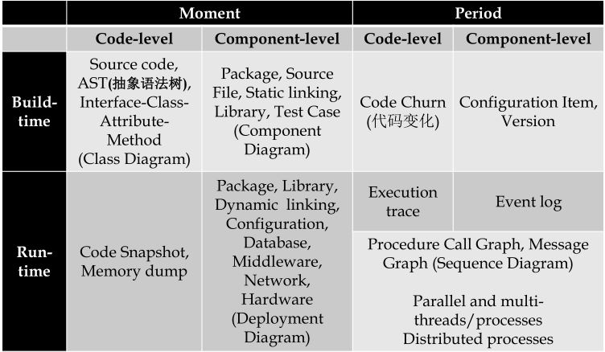

# 软件构造的多维视图

三个维度的视图、描述软件系统的模型、视图之间的转换

1. Code-level view（代码层面视角）：

​       functions, classes, methods, interfaces（built-time、moment）
​       代码快照、内存快照（run-time）

2. Component-level view（组件层面视角）:
   files, directories, packages, libraries（built-time、moment）

3. Moment view（某个时刻视角）:
   在某时刻的样子（静态）

4. Period view（周期视角）:
   主要看的是变化，如代码各个版本的变化，文件各个版本的变化（built-time）
    执行追踪（代码层面）、日志（组件层面）

> 软件构造就是各个层面视角的转换

* * *

# 软件构造的质量指标

> 上一节是讲构造的结果，这节讲如何衡量结果

## 外部质量指标（用户）

1. 正确性(Correctness)：能够按照规约执行，最主要的指标
2. 健壮性(Robustness)：针对异常情况（取决于spec的范畴）的处理能力，对正确性的补充
3. 可扩展性(Extendibility)：易于扩展，用简约主义设计、分离主义设计
4. 可复用性(Reusability)：ADT一次开发，多次使用，利用共性
5. 兼容性(Compatibility)：不同系统间相互容易集成 - > 保持设计的同构性（同一套标准，如文件形式、数据结构、接口定义）
6. 性能(Efficiency)：优化
7. 可移植性(portability)：软件易于在不同技术环境（硬件、操作系统）移植
8. 易用性(Ease of use)：方便用户学会使用
9. 实用性(Functionality)：不能功能繁杂，要简介突出主题
10. 及时性(Timeliness)：赶在用户需要的时候

## 内部质量指标（程序猿）

**决定外部质量指标**

* 可读性
* 可理解性
* 清晰度
* 规模

## 各个质量指标直接的折中

* **正确性**绝对不能和其他因素折中
* 核心的质量指标：**正确性**、**健壮性**、**可扩展性**、**可复用性**

## 软件构造的五个质量目标

1. 可理解性：easy to understand
2. 可复用性：cheap for develop
3. 可扩展性/可维护性：ready for changes
4. 健壮性/正确性：safe from bug
5. 性能：efficient to run

# 软件的生命周期与配置管理

> 第一章主要关注软件构造的结果和结果的衡量，第二章讲软件构造开发的过程

## 软件的开发周期

规划(plan) -> 分析(analyse) -> 设计(design) -> 实现(implement) -> 测试和整合(test&integration) -> 维护(maintainance)

## 传统的软件过程模型

两个基本的类型：

* 线性模型(简单)
* 迭代模型(降低风险)

各种模型

1. 瀑布模型
 线性推进，利于使用，无迭代，但是应对变化的代价高（难以应对风险）
2. 增量模型
 线性推进，增量式(多个瀑布串行)，无迭代，能应对需求变化
3. V-模型
 是瀑布模型的扩展，强化了测试(每个环节都有测试)
4. 原型法prototyping(迭代)
 先只实现系统的原型(模拟最终产品的几个方面)，利于早期获取用户反馈
5. 螺旋模型(迭代)
 风险驱动，多次迭代来规避风险

## 敏捷软件开发

快速**迭代**、小规模持续改进来**快速适应变化**
敏捷 = 增量+迭代

## 软件配置管理SCM和版本管理系统VCS

* 软件配置管理SCM：追踪和控制软件的变化，实际任务是版本控制和建立基线(通过评审和认可后的版本)
* 软件配置项SCI(Software Configuration Item)：软件中发生变化的基本单元(文件)
* CMDB ：配置管理数据库（git仓库） --> 存储软件的各配置项随时间发生变化的信息
  + 基线

## Git——作为SCM的工具

* .git目录相当于本地的CMDB
* 工作目录：本地的文件系统
* 暂存区 Staging area(内存中)：隔离工作目录和git仓库
* 每个文件对应这些状态之一：已修改、已暂存、已提交

Object Graph ：版本之间的演化关系图，一条边A->B 表征了“在版本 B 的基础上作出变化，形成了版本 A”

在git中，文件未发生变化，则后续多个版本始终指向同一个文件，文件发生变化了，存储两份不同的文件，两个版本指向不同的文件

# 软件构造的过程、系统和工具

广义软件构造
> programming编码 -> refactoring重构 -> debugging调试 -> testing测试 -> dynamic code analysis/profiling性能分析 -> code review代码评审 -> build构建
狭义软件构造
> build:

## 广义的软件构造

1. programming（编程）
语言：编程语言(JAVA,C)、建模语言(UML)、配置语言(json)、构建语言
2. Review and static code analysis（静态代码分析）：利用工具进行的静态代码分析
3. Dynamic code analysis / profiling（动态代码分析）：对代码的运行时状态和性能进行度量，发现代码中的潜在问题
4. Debugging and Testing（测试）：定位错误、发现错误根源
5. Refactoring（重构）：在不改变功能的前提下优化代码

